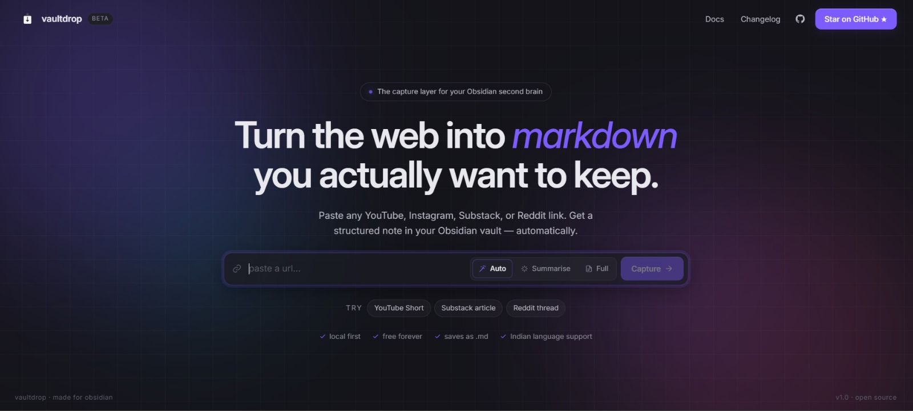

# vaultdrop ⬡

**content → obsidian** — paste any link, get a structured Markdown note saved straight to your Obsidian vault.



## What it does

- Paste a YouTube, Instagram, Substack, Reddit, or any article URL
- Extracts content via yt-dlp (video) or cheerio (articles)
- Transcribes audio with [Sarvam AI](https://sarvam.ai) (handles Hindi/multilingual)
- Summarises with Groq (llama-3.3-70b) into key insights + structured notes
- Saves a `.md` file directly to your Obsidian Inbox folder
- Falls back to manual paste if extraction fails

## Stack

| Layer | Tech |
|-------|------|
| Frontend | React + Vite |
| Backend | Node.js + Express |
| Summarisation | Groq API (llama-3.3-70b) |
| Transcription | Sarvam AI (saaras:v3) |
| Extraction | yt-dlp + cheerio |

## Setup

### 1. Clone and install

```bash
git clone https://github.com/dnyanadapathare/vaultdrop.git
cd vaultdrop
npm install
cd server && npm install
cd ../client && npm install
```

### 2. Configure environment

Create a `.env` file in the root:

```env
GROQ_API_KEY=your_groq_api_key
SARVAM_API_KEY=your_sarvam_api_key
VAULT_PATH=C:\Users\YourName\Desktop\ObsidianVault\Inbox
PORT=3001
```

### 3. Run

```bash
npm run dev
```

Opens the client at `http://localhost:5173` and server at `http://localhost:3001`.

## Requirements

- [yt-dlp](https://github.com/yt-dlp/yt-dlp) installed and in PATH
- [ffmpeg](https://ffmpeg.org/) installed and in PATH (for audio splitting)
- Node.js 18+

## License

MIT
